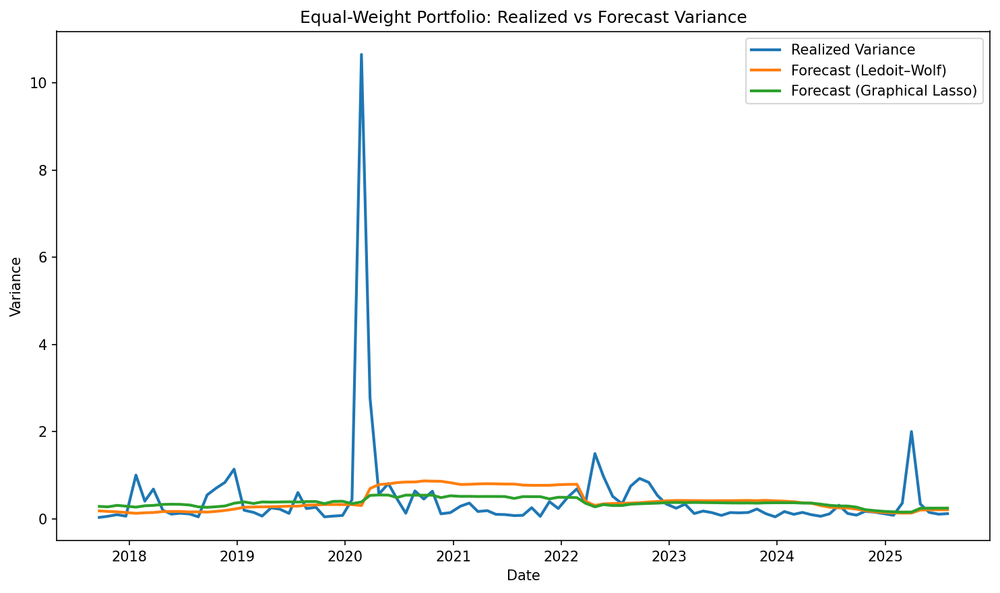
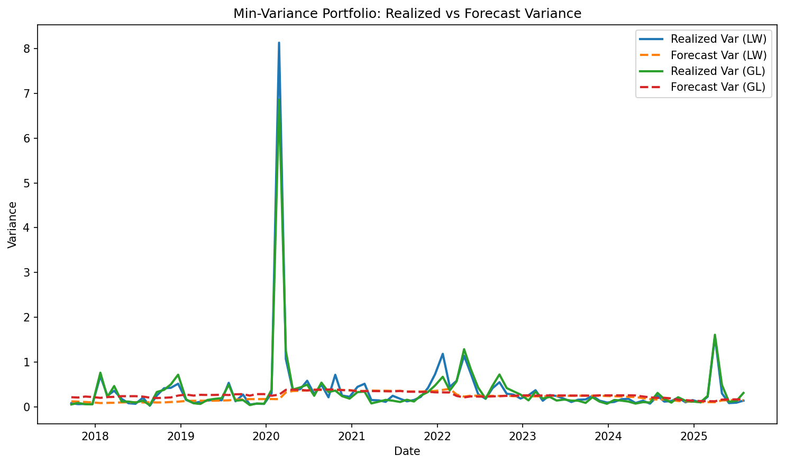

# Precision-Matrix Risk Models

**Quick baseline to compare Ledoit–Wolf (LW) vs Graphical Lasso (GL) precision/covariance estimators for portfolio risk forecasting and stability.**

## What this does
- Pulls market data (daily) for a representative large-cap set (replace with your universe if desired).
- Rolling estimation: 2-year training window, monthly rebalancing.
- Models: **Ledoit–Wolf** shrinkage and **Graphical Lasso** (with CV to pick alpha).
- Portfolios:
  - **Equal-weight (EW)** baseline for risk forecast comparison.
  - **Minimum-variance (MV)** under each model (analytic, sum-to-1; unconstrained/no-short limit).
- **Risk forecast** vs **realized risk** (next-month variance) with MSE/MAE/Bias/Correlation + calibration.
- **Stability**: MV turnover across rebalances.
- **Structure**: GL precision-graph edge density over time.

## Why this is useful 
- LW is a strong shrinkage baseline that reduces sampling noise.
- GL estimates a **sparse inverse covariance** (precision) which can stabilize structure and aid interpretability.
- This repo shows how those differences show up in **out-of-sample risk** and **portfolio stability**.

## Quickstart
Open the notebook and run all cells.
- To change the universe, edit the `tickers` list in section **1) Data**.
- For more assets, be mindful of GraphicalLassoCV runtime; you can pre-specify an `alphas` grid or reduce frequency.

## Methods 
- **Ledoit–Wolf**: shrinks the sample covariance toward a structured target to reduce variance of the estimator.
- **Graphical Lasso**: solves an L1-penalized maximum-likelihood problem for a *sparse* precision matrix; zero off-diagonals imply conditional independencies.
- **Min-variance portfolio** (unconstrained w/ sum=1): \(w \propto \Sigma^-1\mathbf{1}\). We evaluate stability by **turnover** between consecutive rebalances.
- **Risk evaluation**: Compare **forecast** \(\hat{\sigma}^2 = w^\top \hat{\Sigma} w\) against **realized** next-window variance of the portfolio returns.

## Repo structure
```
precision-matrix-risk-models/
├── precision_matrix_risk_models.ipynb
├── requirements.txt
├── README.md
└── LICENSE (optional, e.g., MIT)
```
## Results & Discussion

We evaluate two covariance estimators — **Ledoit–Wolf shrinkage (LW)** and **Graphical Lasso (GL)** — for risk forecasting and minimum-variance (MV) portfolio construction on large-cap S&P 500 equities.

### Equal-Weight (EW) Portfolio


- Both LW and GL forecasts are **much smoother** than realized portfolio variance.  
- Forecasts systematically **underestimate crisis spikes** (e.g., March 2020), consistent with static covariance models.  
- LW tends to produce slightly higher variance forecasts, reducing underestimation relative to GL.  

### Minimum-Variance (MV) Portfolios


- **LW-based portfolios**: lower forecast bias but highly unstable weights, resulting in **large turnover** across rebalances.  
- **GL-based portfolios**: lower turnover and more stable allocations, thanks to sparse precision matrices.  
- Out-of-sample, **GL achieves lower forecast error (MSE/MAE) and better relative calibration** than LW.  

### Turnover & Sparsity


- MV portfolios under LW show **turnover >1.0** on average, making them impractical for implementation.  
- GL portfolios reduce turnover by more than half, while retaining comparable (or better) forecast performance.  
- GL precision matrices are not extremely sparse (edge density ~40–55%), but the structure improves portfolio stability.  

### Quantitative Summary
| Portfolio | Estimator | MSE ↓ | MAE ↓ | Bias | Corr | RelCalib ≈ 1 ideal |
|-----------|-----------|-------|-------|------|------|-------------------|
| EW        | LW        | 1.35  | 0.44  | -0.045 | -0.03 | 0.90 |
| EW        | GL        | 1.29  | 0.39  | -0.088 | 0.02  | 0.81 |
| MV        | LW        | 0.74  | 0.24  | -0.15  | 0.03  | 0.60 |
| MV        | GL        | **0.53** | **0.25** | -0.092 | 0.02  | **0.74** |

---

## Conclusion

- **Ledoit–Wolf shrinkage** provides smoother and more robust covariance estimates but results in **unstable minimum-variance portfolios** with high turnover.  
- **Graphical Lasso** imposes sparsity on the precision matrix, yielding **lower turnover, more stable weights, and improved forecast accuracy**.  
- Both methods under-forecast risk during crisis periods, suggesting the need for **dynamic or regime-switching models** in practice.  

Overall, **Graphical Lasso offers a favorable balance between accuracy and implementability**, making it a strong alternative to shrinkage-only estimators in portfolio risk modeling.

## Next steps / extensions
- Add **no-short** or **box** constraints via `cvxpy` for MV; compare stability again.
- Try sector-neutral or factor-neutral portfolios.
- Expand universe to full S&P 500 and compare runtime vs accuracy.
- Evaluate **tail risk**: realized semi-variance or VaR/ES calibration.
- Compare to **Oracle Approximating Shrinkage (OAS)** or **Nonlinear shrinkage** as extra baselines.
